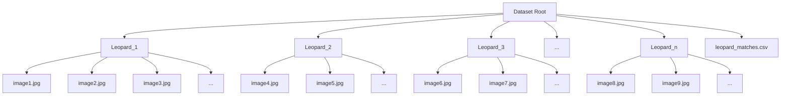
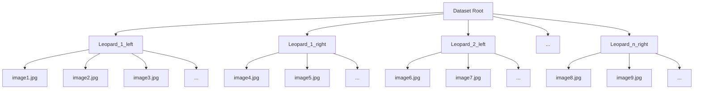

# SpotID: A Leopard Individual Identifier


This project attempts to use Deep Learning to create a Leopard Individual Identifier. Although the focus of the research was advancing the model, a basic user interface for wildlife researchers is provided. The model encodes each leopard image into N dimensional embeddings (vectors), and then these embeddings are compared with one another through a distance metric to decide which images correspond to the same leopard. Two methods were tried, Triplet Networks, and a modified CosFace. The one saved for the user is the modified CosFace, as it reached considerably higher performance compared to the Triplet Network. For more details, please read the attached paper. 

## Instructions for users and developers:

A detailed tutorial for users is provided here: https://youtu.be/YwfC2FA2kZw?si=TOp8Y36oe0Q_ulov

### Step 1: Install the Software
Two options for this.

1. Open terminal on computer, type on terminal:
```bash
git clone https://github.com/ese-msc-2023/irp-dc1823.git
```

2. Go to Github page for the project, click on the green <>Code button, press "Download ZIP"

### Step 2: Navigate to the Project Directory

Open a terminal and navigate to the project directory:
```bash
cd path/to/irp-dc1823
```

Replace path/to with the actual path where you cloned or extracted the project.


### Step 3: Create and Activate a Virtual Environment

First, ensure you have Python 3.10 or later installed. You can check your Python version by running:
```bash
python --version
```

If you need to upgrade, visit the official Python website to download and install the latest version.

Create a virtual environment:

```bash
python -m venv leopard_env
```

Activate the virtual environment:

On Windows:
```bash
leopard_env\Scripts\activate
```

On macOS and Linux:
```bash
source leopard_env/bin/activate
```

### Step 4: Install Required Packages
With the virtual environment activated, install all the required software packages for the project:
```bash
pip install -r requirements.txt
```

You are now ready to use the software for encoding images into embeddings.

### Alternative to Step 3 and 4:
Alternatively, an `environment.yml` is provided, meaning you can create everything seamlessly if you have conda installed: 

```bash
conda env create -f environment.yml
conda activate leopard-id
```

## Instructions for users only

This section outlines how to use the model and the interface for users once the instructions above have been followed. Thus, for people that wish to use the model for leopard individual verification.

Navigate to the interface folder. From leopard_id, this is:

```bash
cd ../interface
```

Run the interface:

```bash
python3 app.py
```

Go to your browser of choice and type:

http://127.0.0.1:5000

Now the interface will open. In it, we have the following functionality:

1. Firstly, we will be shown a landing page with two options. 

    a. If it is your first time running the model, then you will have to select the "run model from scratch" option. In it, you have to provide two paths. Firstly, where do you want the embeddings (the "codifications" of the image of the leopard) to be stored. You need to provide the full path (i.e. "/Users/ab123/Documents/irp-dc1823/leopard_id/embeddings") where you want it to be stored. You also need to provide the path to your directory of raw leopard images. Then, once you click the button, the model will first run all the preprocessing, and then the model designed in this project. If in the future you add further images to your raw dataset, you need to select this option again. It will just run the preprocessing on the new images, not on the whole dataset again. Disclaimer: The preprocessing pipeline is quite slow, approximately 10-15s per image. The model itself is very fast, it takes approximately 15s for a test dataset of 500 images. Although, the preprocessing only needs to be done once per dataset.

    b. If you have already done the step above in the past and thus the preprocessing has been done and the model passed, then you can go with the other option "Open Existing Embeddings". In this option, you provide the path to the existing embeddings directory like in option a, and they will be opened. This is a very fast process. Use this when you are half way done examining your images.

2. Then, the main page will open. Now, you need to: Set a match directory. Set it with a global path (path from root, i.e. "/Users/ab123/documents/leopards"). In this directory, whenever we end the session, the images we have classified will be arranged into their individual leopards that you have matched in subdirectories in this directory. There will also be a csv that outlines which image belongs to which leopard here. See below for final structure.

3. Setting a database or opening one. This is important. This can be directly in this directory, hence just write the name (i.e. leopard_db). If this is a name never seen by the software, it will create a new db. If it is an old database, it will just open it. The benefit of this is that, we can save our progress checking the leopards, and then open the database again, and it will start the process from the last checked leopard! This will be a graph database, which is optimum for it to be "intelligent" (see 4.b).

4. Start comparing! The software will go over each image in the dataset. It will show, in order from most likely to least likely to be a match, the top 5 most similar images, with a confidence value displayed. 

    a. The user can zoom by clicking on the image, and can also toggle between the original cropped image and the edge detected image (which will isolate the spots). If they confirm a match, then the database will link those two images together. If "no match" is clicked, no link is created and the next image is shown. If the user is not satisfied with the comparison images before the 5th comparison image is shown, "next anchor image" can be clicked.

    b. The software is "intelligent", meaning that, if we link image "A" with image "B" when "A" is the "anchor", then when we get to image "B" as an anchor, image "A" will be skipped over the possible matches, as it would mean extra examination effort wasted. Then, don't be worried when, as you've examined a lot of leopards, fewer and fewer correct matches are shown. This is simply because all the correct matches have already been made previously!

    c. When the user needs to stop or when they believe all the correct matches have been made, they can click "end session". This will create a subdirectory structure with all the matched leopards and their corresponding images, and a csv with the filepaths and the leopards they correspond to. Again, if the user needs to continue later on, they just need to write the same database name, and the existing database will be loaded!




Finally, if new images are added to the raw data ("unprocessed_image_folder" above), don't fret, the code has been adapted so that it only runs for the new images each time, so it doesn't take forever. So please don't worry, you can run it with that dataset, and it will only process the new images.

### Extra information:

If the user wants more freedom with what to do with their data, feel free to open `config_inference.json`, and modify the things that you need there. The default parameters should be good to run the default pipeline above, this is just in case you want to save the intermediate images in a different path, etc.  In the preprocessing pipeline, the image will be cropped (stored in "crop_output_folder"), background removed (stored in "bg_removed_output_folder") and edge detected (stored in "base_binary_output_folder"). 

For computer savvy users: `inference_embeddings.py` is the python file that gets ran in the background when we click on "run model from scratch". Hence, again, if the user wants more freedom than what is offered through the interface, please feel free to do so here. For example, if the user has already done the preprocessing elsewhere and has the crop directory and the edge detected directory, the user can set `preprocessing = false`, and provide the path to crop and binary ONLY. The current default config provides paths to the minimum datasets provided with the code, hence by changing the preprocessing to false and running this file, the model will be ran directly without the preprocessing.

## Instructions for developers:

If you are a developer wishing to modify/test the training of the model, follow these instructions. First follow the instructions above in "Instructions for users and developers". Please note that precompiled documentation is available at `docs/build/index.html`. Then:

### data:

Current dataset and dataloader are formatted so that input data must be structured in subdirectories. This means that the raw image data per leopard must be in the following format:



Some minimum usable datasets are provided under `leopard_id/data`, already cropped and binary extracted for ease of use.

### Preprocessing:

NOTE: A minimum usable cropped and edge detected dataset are already provided with the repo under `leopard_id/data`. Hence, if the user only wants to test the model itself and not preprocessing, they can skip this subsection.

As outlined in the paper, one of the keys of this model is the preprocessing. The pipelines first extracts bounding boxes, then removes the background and finally performs edge detection. To do so, we have individual scripts for each. We have created a script that aggregates them all in one, so you only need to run that one. From leopard_id:

Open the `config_inference.json` file and outline where your unprocessed image directory lies, and also the directories where you want to store the 3 preprocessing folders. For the model, we will need the binary output (edge detection) and the crop output, so the background removed is only stored as an intermediate step and just in case you need it for your exploration. If you don't, feel free to delete it.

For example, using the minimum usable dataset already provided with this repo, change the config inference provided (used in the inference for the users above) to:

```bash
    "unprocessed_image_folder": "../data/minimum_train_data_cropped",
    "crop_output_folder": "../data/crop_test",
    "bg_removed_output_folder": "../data/bg_rem_test",
    "base_binary_output_folder": "../data/test_binary_output",
```

The provided data was already cropped, hence the crop pipeline will probably take the whole image. An edge detected output is already provided, hence the name here is changed to demonstrate the deployment of the binary output. If not, 

Once you have done this, we can run the preprocessing.

```bash
cd leopard_id/scripts_preprocessing
```

```bash
python3 run_all_preprocessing.py
```
Be aware that the remove background is a costly procedure, it takes around 10s per image locally. You only need to run this once, and then perform the different training tests with the preprocessed images.

If needed, a `create-train-test.py` is provided under script_preprocessing, which will separate the directories in train and test randomly (not the images). This is to make sure that there are no leopards (even different images) seen in training in the test.

### Training.

From leopard_id, open config.json, and modify it accordingly. The parameters are:

```json
{
    "train_data_dir": "Relative path to train crop output images. 3 channels",
    "test_data_dir": "Relative path to test crop output images. 3 channels",
    "mask_only": "Boolean. If true, only uses binary mask directory below. Recommended to keep it false",
    "train_binary_mask_dir": "Relative path to train binary output images. 1 channel. Can be null, would only use 3 channels above then.",
    "test_binary_mask_dir": "Relative path to test binary output images. 1 channel",
    "method": "'triplet' or 'cosface'",
    "number_embedding_dimensions": "Integer, number of dimensions that vector representing image will have. Higher is more costly and needs more data to train effectively",
    "resize_width": "Integer, number of pixels image width",
    "resize_height": "Integer, number of pixels image height",
    "batch_size": "Integer, batch size used for training data",
    "learning_rate": "Float, initial learning rate, can use scheduler below",
    "epochs": "Integer, total number of epochs",
    "device": "'cuda' or 'cpu'. Can leave it as cuda, as if it doesn't find it it will directly go to cpu",
    "verbose": "Basic essential logs are always logged. This indicates whether to print out extra information. Will store it in logs, so recommended to leave it as true",
    "backbone_model": "'resnet18' or 'tf_efficientnetv2_b2'. Recommended resnet for triplet, efficientnet for cosface",
    "margin": "Float, margin used for triplet and cosface. For modified cosface, it is m1",
    "max_k": "Integer, Maximum number of ranks inspected for evaluating data, see metrics directory for a better explanation",
    "save_path": "Relative path to save model after all iterations",
    "num_last_layers_to_train": "Integer from 1 to 3, number of last layers to train. First 2 are linear layers, last one is convolutional layer",
    "mean_normalize": "Recommendation to leave it as: [0.485, 0.456, 0.406]",
    "std_normalize": "Recommendation to leave it as: [0.229, 0.224, 0.225]",
    "mean_normalize_binary_mask": "Recommendation to leave it as: [0.456]. null if train_binary_mask_dir is null",
    "std_normalize_binary_mask": "Recommendation to leave it as: [0.225]. null if test_binary_mask_dir is null",
    "train_all_layers": "Boolean. Recommendation to leave it as true. If set to true, it overrides num_last_layers_to_train",
    "max_images_individual_leopard_sampler": "Integer, number of images per leopard that will be sampled per batch. See sampler for more information on mechanism",
    "apply_dropout_pixels": "Boolean. Whether to drop out pixels in train set. We recommend to leave it as false",
    "apply_augmentations": "Boolean. Whether to apply rotations and colour augmentations to train set. We recommend to leave it at true",
    "lr_scheduler": "Boolean. Whether to apply a lr scheduler"
}
```
The current config.json contains all the optimum parameters that were found for the Nature Conservation Foundation's training leopard data. A minimum usable dataset is provided with the preprocessing already performed, hence one can directly try the training loops without preprocessing.

With this, we can start training from `leopard_id`. Hence, if you are still in `scripts_preprocessing`, navigate one folder up:

```bash
cd ../
```

Then, simply run:

```bash
python3 train.py
```

Comprehensive logging is provided which will be saved in logs.log. For extra optional logging including angles of exemplars (which will be slightly computationally expensive), set `verbose=True` in config. This is in addition to tensorboard graphs to monitor performance of the model. From `leopard_id`, one can open these graphs with:

```bash
tensorboard --logdir runs
```

### Pytests

Testing is provided under `tests`. They are integrated under the Github workflows and run automatically when there is a commit. If they need to be ran locally, then:

```bash
export PYTHONPATH=path/to/irp-dc1823:$PYTHONPATH
pytest tests/
```

## Citation
If you use this work as part of your research, please cite "Deep Learning for Leopard Individual Identification: An Adaptive Angular Margin Approach":

```bibtex
@misc{colomer2024leopard,
  author       = {Colomer Matachana, David},
  title        = {Deep Learning for Leopard Individual Identification: An Adaptive Angular Margin Approach},
  year         = {2024},
  month        = {August},
  note         = {Unpublished manuscript, available at \url{https://github.com/ese-msc-2023/irp-dc1823}},
}
```


