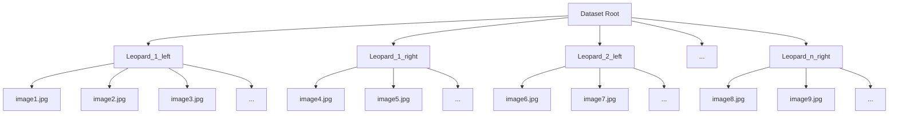

# SpotID: A Leopard Individual Identifier

This project attempts to use Deep Learning to create a Leopard Individual Identifier. It encodes each leopard image into N dimensional embeddings, and then these embeddings are compared with one another through a distance metric to decide which images correspong to the same leopard not. Two methods were tried, Triplet Networks, and a modified CosFace. For more details, please read the attached paper. 

## Instructions for users and developers:

First install the software. Two options:

1. Open terminal on computer, type on terminal:
```bash
git clone https://github.com/ese-msc-2023/irp-dc1823.git
```

2. Go to Github page for the project, click on the green <>Code button, press "Download ZIP"

Then, navigate to the software from your terminal from wherever you are in your directory:

```bash
cd path/to/irp-dc1823
```

Then, install all the required software packages for the project, typing the following on the terminal:

```bash
pip install -r requirements.txt
```

We then have all the steps to encode our images into embeddings. We navigate to "leopard_id" from irp-dc1823

```bash
cd leopard_id
```

## Instructions for users only

This section outlines how to use the model and the interface for users once the instructions above have been followed, so for people that wish to use the model for leopard individual verification.

We open "config_inference.json" with whichever text editor you have available, and edit the needed variables. If the images have not been preprocessed (not cropped), then we need to edit just two variables:

```
    ...
    "preprocess": true,
    "unprocessed_image_folder": "path/to/unprocessed_image_folders",
    ...
```

the "preprocess" flag will indicate to the software that the preprocessing pipeline needs to be ran for the images. In the preprocessing pipeline, the image will be cropped (stored in "crop_output_folder"), background removed (stored in "bg_removed_output_folder") and edge detected (stored in "base_binary_output_folder"). If the user wants any of these variables to be modified, please feel free to do so. We can now run the code to create the embeddings with the saved config file:

On the terminal, from leopard_id subdirectory (that we have navigated to above), we type:

```bash
python3 inference_embeddings.py
```

Disclaimer: The preprocessing pipeline is quite slow, approximately 10-15s per image. The model itself is very fast, it takes approximately 15s for a test dataset of 500 images. Although, the preprocessing only needs to be done once per dataset.

Now, this code saves the embeddings and the distance between them on a subdirectory. This means that we can start with the inference, checking that the matches made are actually correct or not:

Navigate to the interface folder. From leopard_id, this is:

```bash
cd ../interface
```

Run the interface:

```bash
python3 app.py
```

Go to your browser of choice and type:

http://127.0.0.1:5000

Now the interface will open. In it, we have the following functionality:

1. Setting a match directory. Set it with a global path (path from root, i.e. "Users/xy1234/documents/leopards"). In this directory, whenever we end the session, the images we have classified will be arranged into their individual leopards in subdirectories in this directory. There will also be a csv that outlines which image belongs to which leopard here.

2. Setting a database or opening one. This is important. This can be directly in this directory, hence just write the name (i.e. leopard_db). If this is a name never seen by the software, it will create a new db. If it is an old database, it will just open it. The benefit of this is that, we can save our progress checking the leopards, and then open the database again, and it will start the process from the last checked leopard!

3. Start comparing! The software will go over each image in the dataset. It will show, in order from most likely to least likely to be a match, the top 5 most similar images, with a confidence value displayed. 

    - The user can zoom by clicking on the image, and can also toggle between the original cropped image and the edge detected image (which will isolate the spots). If they confirm a match, then the database will link those two images together. If "no match" is clicked, no link is created and the next image is shown. If the user is not satisfied with the comparison images before the 5th comparison image is shown, "next anchor image" can be clicked.

    - The software is "intelligent", meaning that, if we link image "A" with image "B" when "A" is the "anchor", then when we get to image "B", image "A" will be skipped over the possible matches, as it would mean extra examination effort wasted. Then, don't be worried when, as you've examined a lot of leopards, fewer and fewer correct matches are shown. This is simply because all the correct matches have already been made previously!

    - When the user needs to stop or when they believe all the correct matches have been made, they can click "end session". This will create a subdirectory structure with all the matched leopards and their corresponding images, and a csv with the filepaths and the leopards they correspond to. Again, if the user needs to continue later on, they just need to write the same database name, and the existing database will be loaded!


Finally, if new images are added to the raw data ("unprocessed_image_folder" above), don't fret, the code has been adapted so that it only runs for the new images each time, so it doesn't take forever. So please don't worry, you can run it with that dataset, and it will only process the new images.

## Instructions for developers:

If you are a developer wishing to modify/test the training of the model, follow these instructions. First follow the instructions above in "Instructions for users and developers". Then:

### data:

Current dataset and dataloader are formatted so that input data must be structured in subdirectories. This means that the raw image data per leopard must be in the following format:



### Preprocessing:

As outlined in the paper, one of the keys of this model is the preprocessing. We first extract bounding boxes, then remove the background and finally perform edge detection. To do so, we have individual scripts for each. We have created a script that aggregates them all in one, so you only need to run that one. From leopard_id:

Open the `config_preprocessing.json` file and outline where your unprocessed image directory lies, and also the directories where you want to store the 3 preprocessing folders. For the model, we will need the binary output and the crop output, so the background removed is only stored as an intermediate step and just in case you need it for your exploration. If you don't, feel free to delete it.

Once you have done this, we can run the preprocessing.

```bash
cd scripts_preprocessing
```

```bash
python3 run_all_preprocessing.py
```
Be aware that the remove background is a costly procedure, it takes around 10s per image locally. You only need to run this once, and then perform the different training tests with the preprocessed images

If needed, a `create-train-test.py` is provided under script_preprocessing, which will separate the directories in train and test randomly (not the images). This is to make sure that there are no leopards (even different images) seen in training in the test.

### Training.

From leopard_id, open config.json, and modify it accordingly. The parameters are:

```json
{
    "train_data_dir": "Relative path to train crop output images. 3 channels",
    "test_data_dir": "Relative path to test crop output images. 3 channels",
    "mask_only": "Boolean. If true, only uses binary mask directory below. Recommended to keep it false",
    "train_binary_mask_dir": "Relative path to train binary output images. 1 channel. Can be null, would only use 3 channels above then.",
    "test_binary_mask_dir": "Relative path to test binary output images. 1 channel",
    "method": "'triplet' or 'cosface'",
    "number_embedding_dimensions": "Integer, number of dimensions that vector representing image will have. Higher is more costly and needs more data to train effectively",
    "resize_width": "Integer, number of pixels image width",
    "resize_height": "Integer, number of pixels image height",
    "batch_size": "Integer, batch size used for training data",
    "learning_rate": "Float, initial learning rate, can use scheduler below",
    "epochs": "Integer, total number of epochs",
    "device": "'cuda' or 'cpu'. Can leave it as cuda, as if it doesn't find it it will directly go to cpu",
    "verbose": "Whether to print out information. Will store it in logs, so recommended to leave it as true",
    "backbone_model": "'resnet18' or 'tf_efficientnetv2_b2'. Recommended resnet for triplet, efficientnet for cosface",
    "margin": "Float, margin used for triplet and cosface. For modified cosface, it is m1",
    "max_k": "Integer, Maximum number of ranks inspected for evaluating data, see metrics directory for a better explanation",
    "save_path": "Relative path to save model after all iterations",
    "num_last_layers_to_train": "Integer from 1 to 3, number of last layers to train. First 2 are linear layers, last one is convolutional layer",
    "mean_normalize": "Recommendation to leave it as: [0.485, 0.456, 0.406]",
    "std_normalize": "Recommendation to leave it as: [0.229, 0.224, 0.225]",
    "mean_normalize_binary_mask": "Recommendation to leave it as: [0.456]. null if train_binary_mask_dir is null",
    "std_normalize_binary_mask": "Recommendation to leave it as: [0.225]. null if test_binary_mask_dir is null",
    "train_all_layers": "Boolean. Recommendation to leave it as false. If set to true, it overrides num_last_layers_to_train",
    "max_images_individual_leopard_sampler": "Integer, number of images per leopard that will be sampled per batch. See sampler for more information on mechanism",
    "apply_dropout_pixels": "Boolean. Whether to drop out pixels in train set. We recommend to leave it as false",
    "apply_augmentations": "Boolean. Whether to apply rotations and colour augmentations to train set. We recommend to leave it at true",
    "lr_scheduler": "Boolean. Whether to apply a lr scheduler"
}
```

With this, we can start training. Simply run:

```bash
python3 train.py
```


