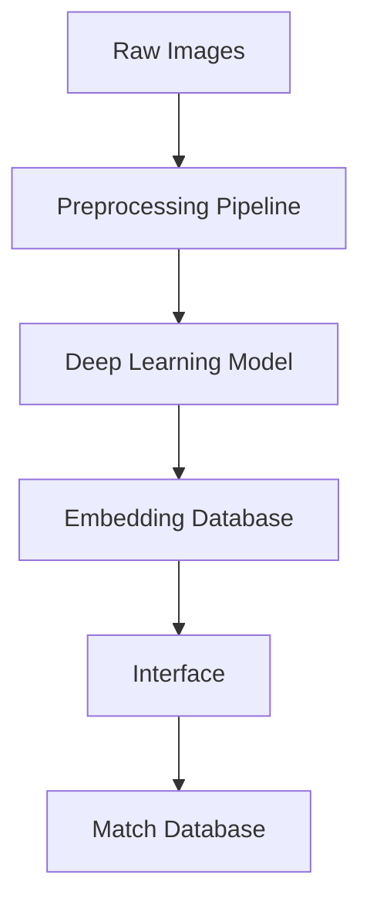
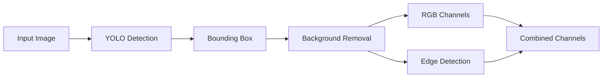
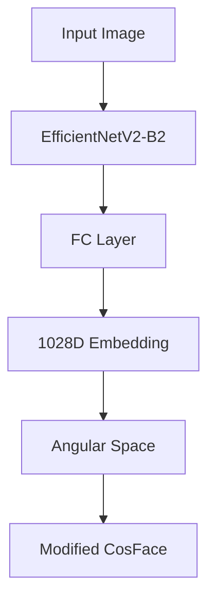
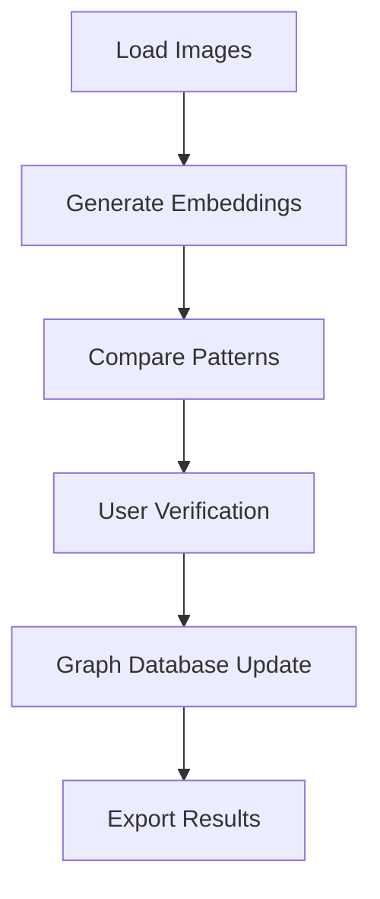

# System Patterns: SpotID

## Architecture Overview

### Core Components

## Design Patterns

### 1. Preprocessing Pipeline

### 2. Model Architecture

### 3. Data Flow Patterns

#### Training Flow
- Dataset organization by individual/flank
- Custom sampler for batch creation
- Semi-hard negative mining
- Adaptive angular margin calculation

#### Inference Flow
- Preprocessing of new images
- Embedding generation
- Cosine similarity comparison
- Top-5 match selection

### 4. Interface Patterns

#### User Interaction Flow

## Key Technical Decisions

### 1. Model Selection
- **Decision**: Use EfficientNetV2-B2 backbone
- **Rationale**: Balance between performance and computational efficiency
- **Consequences**: Better accuracy than ResNet-18 with similar parameter count

### 2. Angular Margin Function
- **Decision**: Implement modified margin function h(θ)
- **Rationale**: Better handling of hard exemplars and minority classes
- **Consequence**: Improved separation in embedding space

### 3. Database Architecture
- **Decision**: Use graph database for matches
- **Rationale**: Natural representation of leopard relationships
- **Consequence**: Efficient querying and update operations

### 4. Interface Design
- **Decision**: Flask-based web interface
- **Rationale**: Lightweight, easy to deploy
- **Consequence**: Accessible to researchers without installation

## Performance Patterns

### Optimization Strategies
1. Image preprocessing caching
2. Batch processing for embeddings
3. Efficient graph traversal for matches
4. Memory-efficient storage of embeddings

### Error Handling
1. Graceful degradation for failed preprocessing
2. User verification for uncertain matches
3. Progress saving for long sessions
4. Automatic backup of match database

## Testing Patterns
1. Unit tests for model components
2. Integration tests for pipeline
3. Accuracy metrics on test set
4. Performance benchmarking
